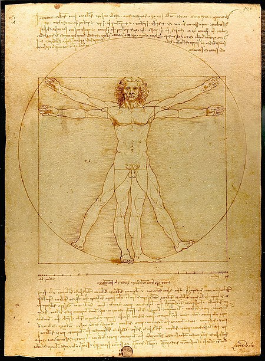

## Question 2 -- Measurement data

###  part a -- reading in the data and 'cleaning' it:   1 pt

```{r setup, message = FALSE, warning = FALSE}
knitr::opts_chunk$set(echo = TRUE)

#  Load the tidyverse (or ggplot2 and dplyr) below:
library(tidyverse)

#  Download the MeasureF21.csv data; put it in your Stat/CS 087 project folder; read it like this:
m <- read.csv('MeasureF21.csv', stringsAsFactors = TRUE,
              na.strings = '')

tibble(m)
names(m)[1] <- "Response_id" # response id appeared in a strage way

#  Data cleaning done in class must be included here:
mnew <- m %>% filter(Response_id != 1199794,
                     Head > 20) %>% 
  mutate(Response_id = as.factor(Response_id),
         RFoot = ifelse(RFoot > 20, RFoot/2.54, RFoot),
         LFoot = ifelse(LFoot > 20, LFoot/2.54, LFoot))


```

```{r lookatdata}
#  Print the data file (it's not too long), and make sure it is 'cleaned'.
mnew

#  Do a summary of the data
summary(mnew)

hist(mnew$Height)
hist(mnew$Armspan)
hist(mnew$Head)
hist(mnew$LFoot)
hist(mnew$RFoot)
hist(mnew$Lhand)
hist(mnew$Rhand)


#  Something new.  Install the package psych, and try this:
library(psych)
pairs.panels(mnew[,3:9])

```

### part b: Plots with regression lines:   2 pts


```{r plots, message=FALSE, warning=FALSE}
# Using ggplot, create a scatterplot of Armspan by Height, adding a regression line to the plot.  Do remove the confidence band on the regression line.  Repeat with LFoot by Height, then with Lhand by Height.

# Scatterplot of Armspan by Height
ggplot(data = mnew,
       mapping = aes( x = Height, y = Armspan))+
  geom_point() +
  geom_smooth(method = 'lm', se = FALSE)

# Scatterplot of LFoot by Height
ggplot(data = mnew,
       mapping = aes( x = Height, y = LFoot))+
  geom_point() +
  geom_smooth(method = 'lm', se = FALSE)

# Scatterplot of Lhand by Height
ggplot(data = mnew,
       mapping = aes( x = Height, y = Lhand))+
  geom_point() +
  geom_smooth(method = 'lm', se = FALSE)

```


### part c:  Linear regression equations:   2 pts

```{r linearmodels}
# Create the linear model object for Armspan by Height, as we did in class, and do a summary of the object.   Repeat with LFoot by Height, then Lhand by Height.

# Linear model object for Armspan by Height
armspanHeight <- lm(Armspan ~ Height, data = mnew)
summary(armspanHeight)

# Linear model object for LFoot by Height
lfootHeight <- lm(LFoot ~ Height, data = mnew)
summary(lfootHeight)

# Linear model object for Lhand by Height
lhandHeight <- lm(Lhand ~ Height, data = mnew)
summary(lhandHeight)

```

### part d:  Interpret slopes:   2 pts

*Note the slope of each regression line, and summarize each slope, as we did in class: (For each….)  Write your answers in text in the white part right here:*   

All slopes are linear and positive.

For each additional 4 inches of height, there is a 1.16840 increase in predicted inches of Armspan.

For each additional 4 inches of height, there is a 0.15627 increase in predicted inches of left foot length.

For each additional 4 inches of height, there is a 0.08150 increase in predicted inches of left hand length.


### part e:  Find correlation coefficients:   1 pt

```{r}
# Using dplyr, find the correlation coefficients for each relationship, using as much data as you can (i.e., don’t remove values that are missing for variables other than the two under consideration).  

# Correlation coefficent for for Armspan by Height
ah <- mnew %>%filter(!is.na(Armspan), !is.na(Height))
cor(ah$Armspan, ah$Height)

# Correlation coefficent for for Armspan by Height
fh <- mnew %>%filter(!is.na(LFoot), !is.na(Height))
cor(fh$LFoot, fh$Height)

# Correlation coefficent for for Armspan by Height
hh <- mnew %>%filter(!is.na(Lhand), !is.na(Height))
cor(hh$Lhand, hh$Height)

```

### part f:  Interpret   2 pts

*Summarize your findings, comparing the results for the three relationships.  What was the general phenomenon responsible for the relationships?  Which relationship is strongest? weakest?  Why would that be, in terms of what you know about human bodies?*

All relationships are positive. Armspan by Height has clearly the strongest relationship ( r = 0.900346 ), then left foot by Height( r = 0.7175355 ) and the least is Left Hand by Height ( r = 0.4489903 ). I believe that the reason for these relationships is due to evolution and how our bodies were made to support us, so we are able to move bipedally. 

The most obvious causation for a strong relationship between feet length and height, is that the feet are what supports our body and it makes sense that the taller you are the longer your feet should be. I think hands are not that important height wise and maybe that is why it has the weakest relationship. 

Trying to think of a reason for the relationship of armspan and height, the image of the "Vitruvian Man" by Leonardo da Vinci popped up. That drawing represents Leonardo's concept of the ideal human body proportions, and we can see how a square and a circumference surround the body. If we take a closer look, we can see that the height and the armspan perpendicular to the body, both are equal to the side length of the square. The causation of this could be so that our bodies are proportional, meaning their relative magnitudes are in balance and make sense the way they are. 





